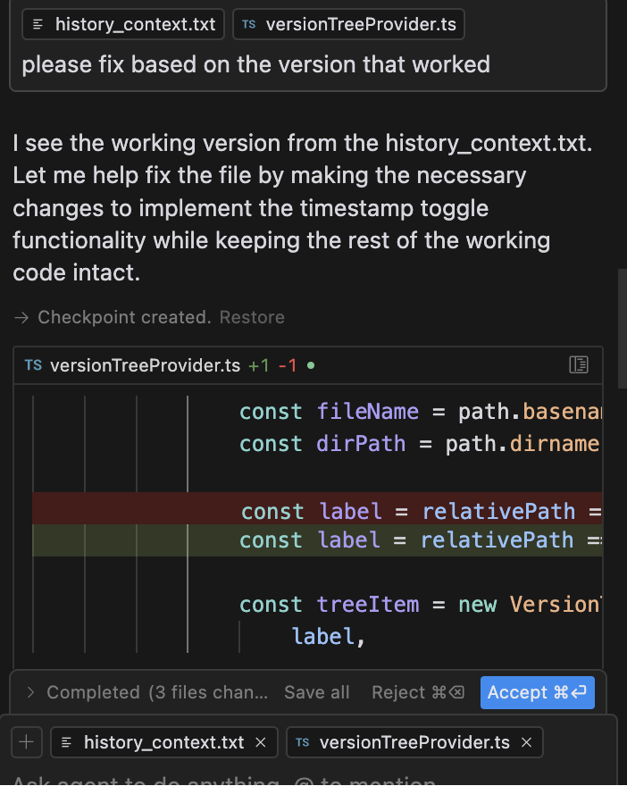

# Quick Checkpoint

Quick Checkpoint is a VS Code extension that helps you use code history as context when working with AI coding assistants. It is useful for quick checkpoint as context to help undo when LLMs break your code.

## Features

  
  "

### Version Management
- **Automatic Version Saving**: Automatically saves versions of your code as you make changes
- **Smart Detection**: Only saves significant changes to avoid cluttering your history, automatically remove old versions on new commit
- **Version Tree View**: Dedicated sidebar showing all tracked files and their versions
- **Git Integration**: Preserves commit messages and can clean up versions after commits

### Quick Actions
- View, export, or delete specific versions
- Quick clean to keep only latest versions
- Append multiple versions to build context history (+ button)

### Context Management
- Export versions to provide context to AI assistants
- Append multiple versions to build comprehensive context
- Track version history relative to prompts ("1 prompt ago", "2 prompts ago")
- Preserve git commit messages in version history

## Requirements

- VS Code version 1.95.0 or higher
- Git Intergration

## Extension Settings

This extension contributes the following settings:

* `llmcheckpoint.showInfoMessages`: Enable/disable information messages for operations like saving, exporting, and deleting versions
* `llmcheckpoint.autoCleanupAfterCommit`: Automatically cleanup versions after git commit, keeping only the latest version renamed with the commit message

## Using the Extension

1. **Save Versions**:
   - Automatically saves when you make significant changes
   - Click the "Save Version" button in the editor title bar

2. **View History**:
   - Open the Quick Checkpoint sidebar (clock icon)
   - Click versions to view their contents

3. **Manage Versions**:
   - Export versions for LLM context
   - Append multiple versions together
   - Quick clean to keep only latest versions
   - Delete individual versions or clear all

4. **Git Integration**:
   - Versions are tagged with commit messages when available
   - Optional automatic cleanup after commits
   - Preserves version history alongside git history

## Known Issues

Please report any issues on our [GitHub repository](https://github.com/ntna141/Quick-Checkpoint).

## Release Notes

### 0.0.1

- Initial release
- Basic version management
- Git integration
- Version tree view
- Export and append functionality
- Quick clean features

---

## Contributing

Found a bug or have a feature request? Please open an issue on our [GitHub repository](https://github.com/ntna141/Quick-Checkpoint).
